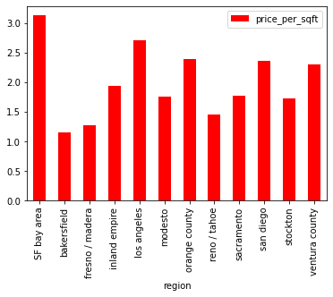

# California Apartment Rental Prices

## Purpose

The purpose of this project is to analyze factors that affect California apartment rental prices.
  

### Technologies Used:
* Python, Pandas, NumPy, SciPy, Matplotlib, Seaborn
  

### Limitations:
* Please consider that the data is derived from Craigslist, and its data is inputted by users who may not be real estate professionals 
* Data provided by traditional real estate sources, such as the California Regional Multiple Listing Service (CRMLS), LoopNet, or CoStar is usually entered by real estate professionals, such as state licensed agents/brokers who utilize state licensed real estate appraisers.
* Real estate professionals utilize market data to determine rent, whereas laymen may determine rent without the necessary market data. 
* Therefore, Craigslist’s real estate data may be uniquely diverse compared to a database that is maintained by real estate professionals.   
* The focus of this project is on California due to time constraints
  

## Data Source: Kaggle
* The [(Kaggle dataset)](https://www.kaggle.com/austinreese/usa-housing-listings) returns information on USA housing data derived from January 2020 Craiglists listings. Information contained in this data set include listing id, url, region, price, type, sqfeet, beds, baths, cats_allowed, dogs_allowed, smoking_allowed, wheelchair_access, electrical_vehicle_charge, laundry_options, parking_options, image_url, description, lat, long, and state. 
  

### High-Level Overview:
We read the USA housing data, using Pandas, onto a Jupyter Notebook. From there, we used Pandas to prep our data set to identify anomalies and trends. This includes filtering for relevant data, converting unix time stamp to normal date time, and creating a dataframe to house our clean data. We then used Matploblib for visualization and linear regression for predictions. From there, we were able to identify anomolies and trends.

* Download data
* Create main branch and sub branch in Github
* Open Jupyter Notebook
* Use Pandas to read, clean, and format dataset
* Describe data/data exploration 
* Find correlation - which fields have stronger relation (e.g, apartment price and region)
* Use Matplotlib and Pandas for visualization
* Use linear regression for prediction
* Summarize findings
* Present 

## Visualizations
### Data Accuracy - Removing Outliers
* Initially, the California apartment pricing data contained significant outliers as shown below
* The Inland Empire, specifically, contained an apartment monthly rental price of over $2M 

  

* The Box Plot graph below shows that the normal range lies between $107 - $3419

  

### Regional Breakdown
* The pie chart below shows that the new, cleaned dataframe consists of 12 California counties  
* Each of these counties contained a sample size of over 1,000 data entries 
* Each county contained data entries between 4.9% to 9.8% of the new, cleaned data frame’s cumulative total with Modesto as the lowest and Stockton, Ventura, Orange, and Inland Empire as the highest

  

### Price Per Square Feet
* San Francisco possesses the highest median rent per SF at over $3.00 per SF and Bakersfield possesses the lowest median rent per SF at just over $1.00 per SF

  

### Price 
* San Francisco has the highest median rent at just under $2,500 and Bakersfield has the lowest median rent at just over $1,000

  

### Beds
* San Francisco has the lowest median number of bedrooms with just over 1 and Bakersfield has among the highest median number of bedrooms with 2
 

  

### Heatmap
* Price is not significantly correlated to other categories  
* Bedrooms and bathrooms are significantly and positively correlated  

  

